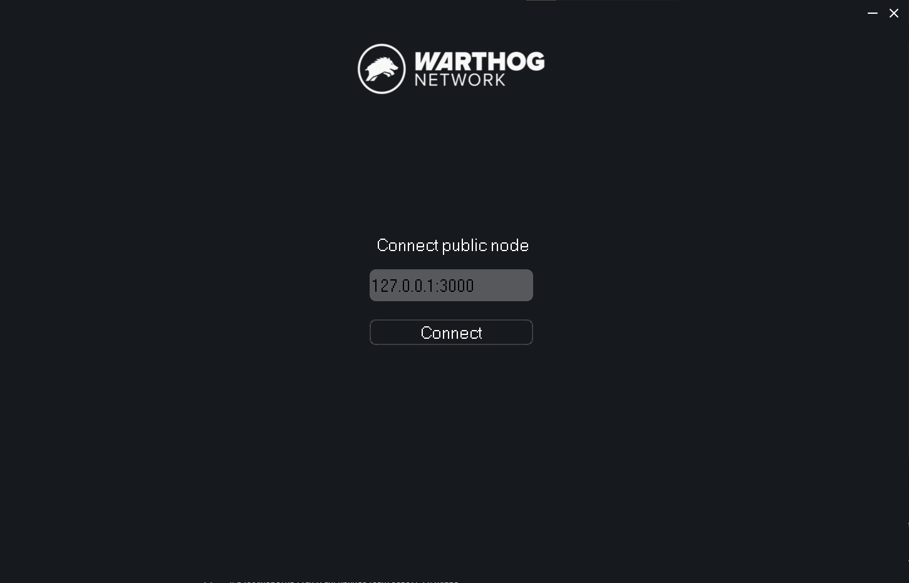
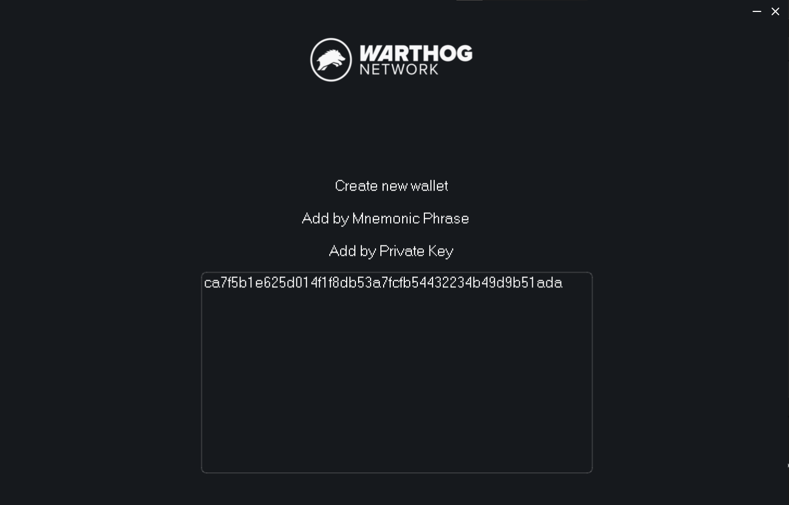
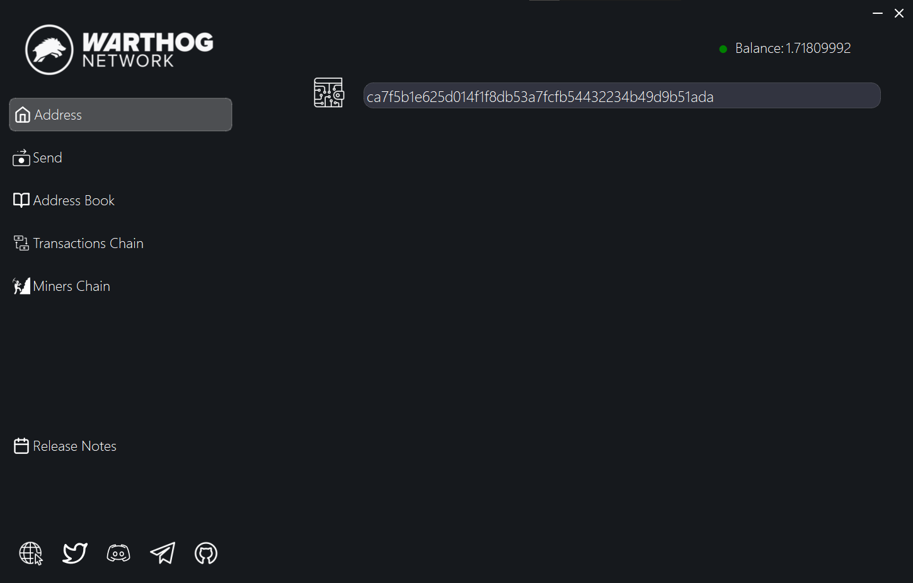
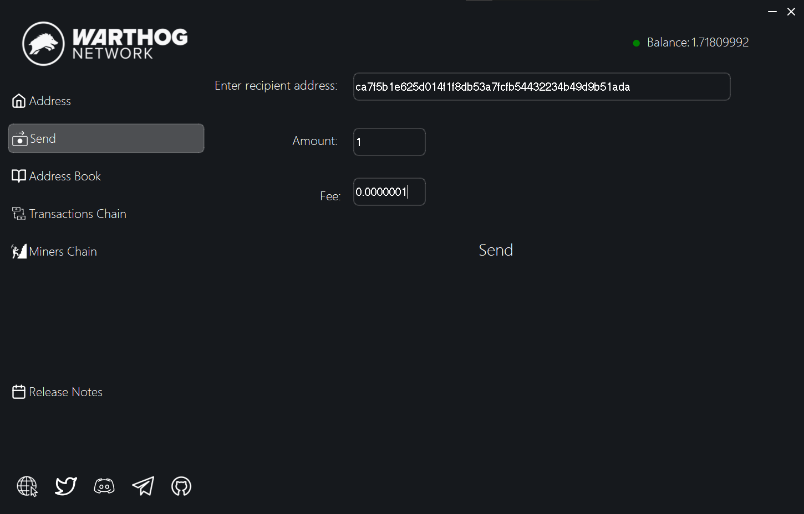
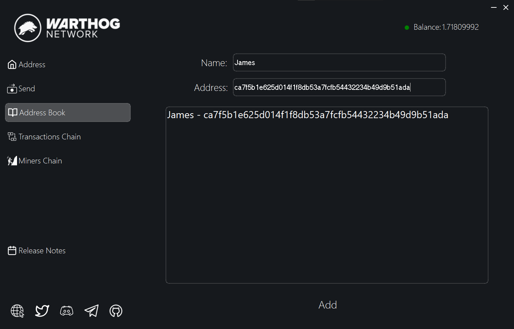
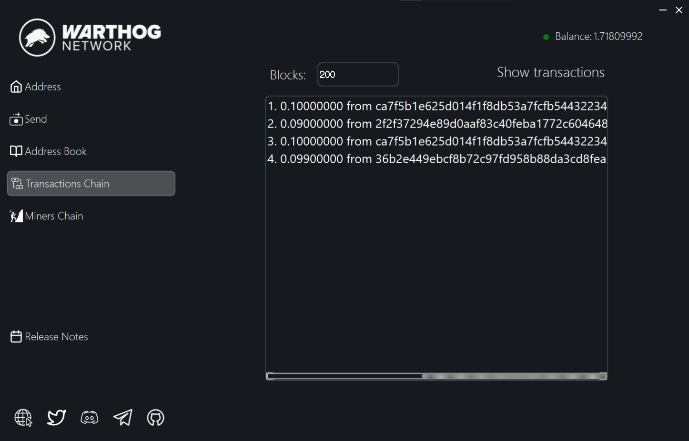
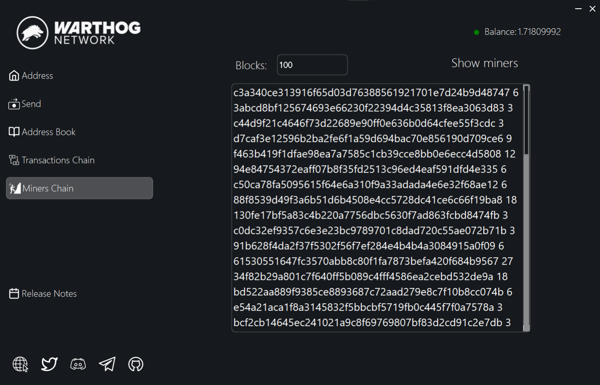
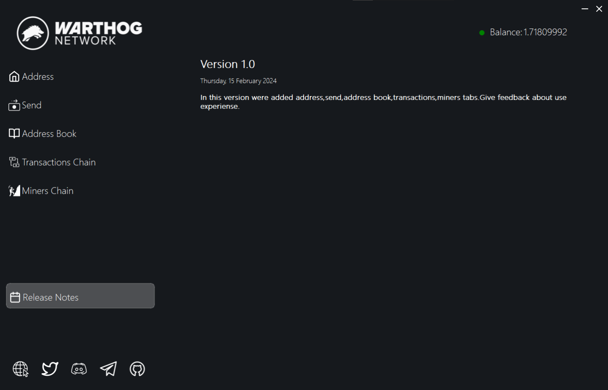

# Wart Dapp
Download [here](https://github.com/warthog-network/wart-dapp/releases).

At the very beginning, you are taken to the window for selecting a connection method. If you don’t want to, don’t know how, or for some other reason don’t have your own node running, then click on ‘Connect public node’ and the application will automatically connect to the public node.If you want to use a connection to your own node, enter the node’s IP address and port.

The next is the wallet selection window, you can create a new wallet, import by mnemonic phrase or private key, after which the wallet will be saved and visible in the field below (when you log in again, you need to select the address you want to work with at the moment and enter the password)

The next window is the main menu of the application; each function will be described below.

The first tab displays the address of the wallet currently selected for operation.

Tab for creating transactions.

Next is the Address Book tab, here you can save addresses that are important to you and assign names or titles to them, after which you can conveniently use them at any time

The next tab is Chain Transactions, here in the “blocks” field you need to enter the number of blocks for which you want to see all the transactions of the network, for example: If you enter, for example, 300 blocks, then with the current height of 999400 blocks we will get 999400-300 =999100, that is, you will see all transactions on the network for the period from block 999100 to the current 999400

Next is the Miners Chain tab, the principle of operation is the same as the Transactions Chain tab, only as a result you will receive the addresses of all the miners who mined blocks in the interval of your choice and opposite each address the number of coins mined by them in the interval of blocks you selected.

And at the moment the last tab is Release Notes, where all the changes for each version of the application are summarized.

